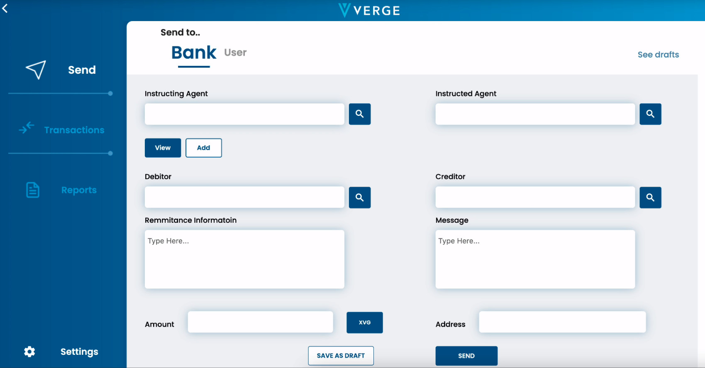

<pre>
  VIP: 0002
  Layer: Applications
  Title: Proposal for Implementation of ISO20022 in the Applications Layer
  Author: [John Doe](maddeezy@users.noreply.github.com)
  Comments-Summary: No comments yet.
  Status: Draft
  Type: Standards Track
  Created: 2023-02-14
</pre>

**Discussion**

All parties interested are encouraged to join the open forum.

Open Forum Discussion: (https://momoboard.com/verge-currency-vips)

Please abide by the [VIP-0001](../vip-0001/vip-0001.md) when joining and wanting to participate

**Abstract**

This proposal outlines the implementation of ISO20022 in Verge Currency's application layer to facilitate easy adoption for transactions using XVG. The proposed enhancements aim to improve scalability, adoption, and ease of use for institutions using XVG as an alternative payment, providing security and speed for ISO20022 transactions.

**Motivation**

Verge Currency needs application support for ISO20022 compliance to enable banks and exchanges to easily adopt XVG for transactions. The proposed implementation will not change Verge Currency's native blockchain, but will enhance scalability, adoption, and ease of use for institutions to use XVG as an alternative payment.

**Specification**

The proposed interface will be written in Dart. Propsed design would be:

The proposed implementation will provide application support for ISO20022 in Verge Currency's application layer. This will involve the following standards:

[standards of implementation]

**Rationale**

[TBD]

**Backwards Compatibility**

No implementation of ISO20022 at this time would require any backwards compatibility, however, future implementations may require backwards compatibility and all tests here forward MUST pass all tests prior to merging any commits to the upstream branch

**Reference Implementation**

[Block 6538876](https://verge-blockchain.info/block/0035c9fba325e4f2acd1847314545bc56c395e4ac94705c624dd6405ab087e3c)

[tx id 9a2c1c40f79cd355899fa8a62012f0741a9588b859abd57340b7e7ec4b07fbf1](https://verge-blockchain.info/tx/9a2c1c40f79cd355899fa8a62012f0741a9588b859abd57340b7e7ec4b07fbf1)

**See Also**
