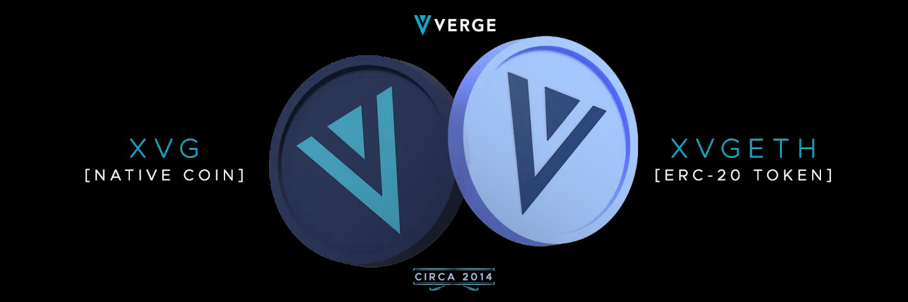

<pre>
  VIP: 0003
  Layer: Application Layer 2
  Title: Proposal for Implementation of XVG ERC-20 on the Ethereum Blockchain
  Author: [John Doe](maddeezy@users.noreply.github.com)
  Comments-Summary: No comments yet.
  Status: Complete
  Type: Standards Track
  Created: 2023-10-25
</pre>

**Abstract**

https://github.com/vergecurrency/erc20/blob/54265194a5df654ba80a3f695e6f43dad7cf4153/XVGETH_Whitepaper_v1.pdf

**Motivation (FAQ)**

https://medium.com/vergecurrency/verge-currency-erc-20-faq-6f1f83d782a6

**Specification**

https://etherscan.io/token/0x85614a474dbeed440d5bbdb8ac50b0f22367f997#code

**Backwards Compatibility**

Users will be able to swap XVG Native Coins with this new XVG ERC-20 token value.

**Reference Implementation (Official Contract)**

https://etherscan.io/token/0x85614a474dbeed440d5bbdb8ac50b0f22367f997
